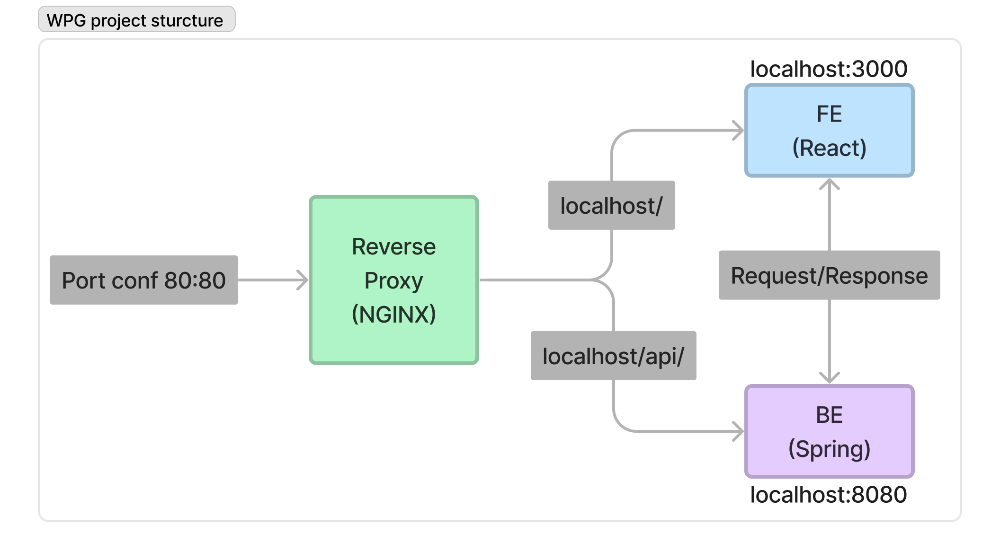

# Software Developer Test

## Project Description



This is simple full-stack application featuring a React frontend and a Spring backend, containerized using Docker with a simple reverse proxy server on NGINX.

#### Server Configuration:

- NGINX listens for incoming connections on port 80, so it can be accessed on `http://localhost`
- Requests for path `localhost/` are routed to the frontend service
- Requests for path `localhost/api/` are routed to backend service
- `localhost/api/date-service` returns the current datetime for Seoul
- `localhost/api/number-service` returns a random number
- Frontend listens on `localhost:3000`
- Number service is listening on `localhost:8080` and date service is listening on `localhost:8081`

## Requirements

You need to install:

1. [Git](https://git-scm.com/downloads)
2. [Docker](https://docs.docker.com/get-docker/)
3. [Docker compose](https://docs.docker.com/compose/install/)

then just open your terminal and run these commands:

### Works on Linux, Mac or Windows

```
git clone https://github.com/saprunovdev/wpg.git
cd wpg
docker-compose up
```

On mac run docker-compose up again, after you get an error

```
docker-compose up
```
